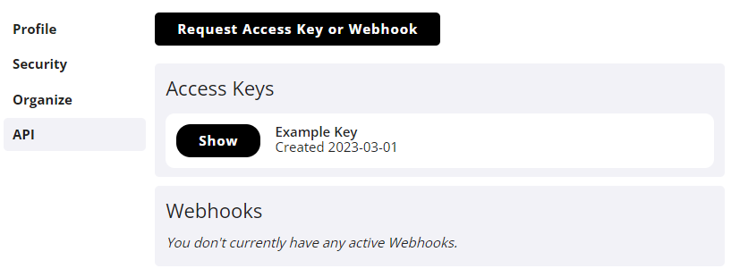

# Introduction

In this guide you can find all the information you need to make use of tournament data from the Limitless tournament platform. Our API provides several endpoints for accessing data like placings, decklists and matches, as well as a webhook system that can be used for updates on finished tournaments. 

::: info
If you run into any questions or issues, or have other feedback, join our **[Discord server](https://discord.gg/UG4zTC6)** and use the appropriate channels there.
:::

## Access Keys
To use the API endpoints, you need an Access Key. To get one, go to [your user API settings](https://play.limitlesstcg.com/account/settings/api) and fill out the form that is linked at the top.

Once approved, you can look up your key on that same page. When filling out the form, you can set a name for the key (e.g. the name of the app it is used for).

## Authentication
A valid Access Key must be sent with every single request to the API, otherwise no response will be returned.

There are two accepted ways of adding your key to a request:
- Append it to the requested URL as a query parameter named *key*.
- Add it to the request as a HTTP header with the name *X-Access-Key*.

## Showcase
Here are some example applications that are built with tournament data from the Limitless platform.
* [Trainer Hill](https://www.trainerhill.com/) - Player & deck rankings, matchup analysis and much more for the Pokémon TCG
* [VGC Tournament Ladder](http://ladder.bennbuild.io/) - Player rankings for the Pokémon Video Game