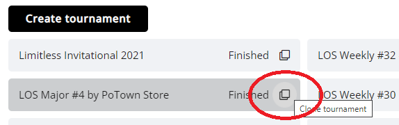
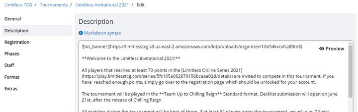

# Creating a Tournament

Any user with the admin or organizer role can create tournaments for the organization. Click *Create tournament* on the *Tournaments* page and select one of the supported games.
In the following, we'll go over the most important tasks when setting up your first tournament. To get to know all the possible settings, check out the **[tournament settings reference](/organizer/reference)**.

## Cloning Tournaments

If you are regularly running tournaments, you will not want to set up every single one from scratch. Instead, you can create a new tournament by cloning an already existing one.
Click the icon in the right corner of the tournament you want to duplicate and enter a name for the new tournament. All applicable settings will then be copied over.

## Tournament Basics

After opening the admin page of your first tournament, go to *Edit tournament*.

This is where you configure the tournament settings. These are the kind of settings that you set up once before the tournament, and usually don't need to come back to. Most options can be edited at any point though, even after the tournament has already started. When cloning a tournament, the options here are what gets copied over to the new tournament.

When you create a tournament, it is by default unpublished. Before you publish the tournament, only you and other admins of the tournament will be able to interact with it. To preview how the public tournament page looks like, you can use the *Tournament page* link at the bottom of the previous page.

Two settings you always need to update are the tournament date & time (in *Information*), as well as the format (in *Game Specific* - unless the game you are creating the tournament for only has one format). In most cases, you will also want to turn on decklist/teamlist submission.

## Adding a Tournament Description

Before publishing your tournament, you should go to *Edit tournament > Description* and add a description that includes everything players need to know about the tournament.

You can use [markdown](https://www.markdownguide.org/getting-started/) to format your text, a simple and declarative syntax for styling, adding images and similar needs. Refer to [this guide](https://www.markdownguide.org/basic-syntax/) to find out how it works. Alternatively, you can use HTML with inline CSS for more complex styling needs, but markdown should usually be all you need (as a sidenote, this guide you are reading right now is written completely in markdown).

## Adding Staff Members

Tournaments have two different staff roles, admins and judges. These are unrelated to the roles in the organization—each tournament has its own staff composition. However, to be part of the tournament staff, a user needs to be a member of the organization.

Tournament admins have full control over the tournament, most importantly editing all the settings and starting tournament rounds. Judges have access to all match pages to chat with the players, reset matches and report games, but they cannot edit the tournament itself.

When you create a fresh tournament, only you are added to the tournament as an admin. Other members of the organization will not have access to it or see it in the list of tournaments. To add them to the tournament, go to *Edit tournament > Staff*, and use the drag and drop interface to assign roles as needed.

Note: Someone who is part of the organization as the judge role can still be added as an admin to individual tournaments. The difference between the organization's admin and a tournament admin is that the former can create tournaments themselves, while the latter only has access to the tournaments that they have been assigned to.