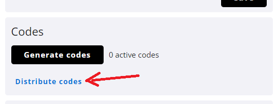
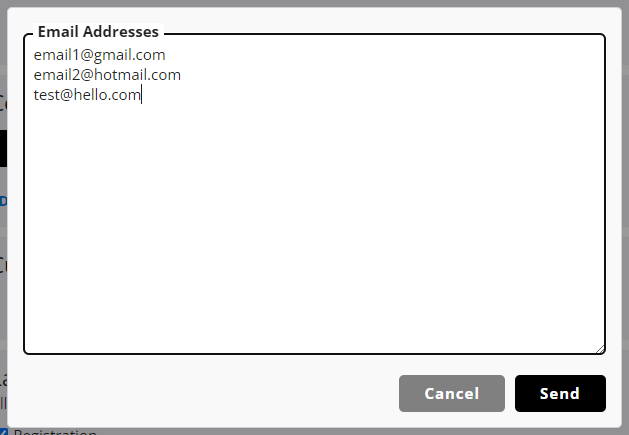
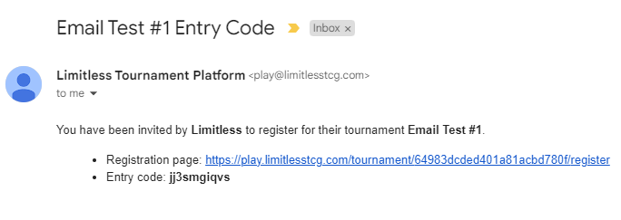

# Entry Code Emails

**Note: This feature is not included by default and needs to be manually enabled for an organization. You can contact us for more information.**

When running a tournament with an entry cost or other restrictions, you likely want to make use of single-use entry codes. One option is to generate the number of codes you need and distribute them to players with your own systems.  
If you have a list of email addresses that should receive an entry code, you can also use the platform's built-in distribution tool instead.

Enter the email addresses in the text area (one per line), and click send. This will automatically generate a new entry code for every address entered and send it out per email.  
Then, it will return a csv file with all the newly created entry codes and the email addresses they belong to. Make sure to keep this file for the case of any issues. The email addresses entered into this tool are not saved in our database, so that file is the only way to later look up where each code was sent to.

In addition to their individual entry code, the email that players receive includes a link to the registration page.

