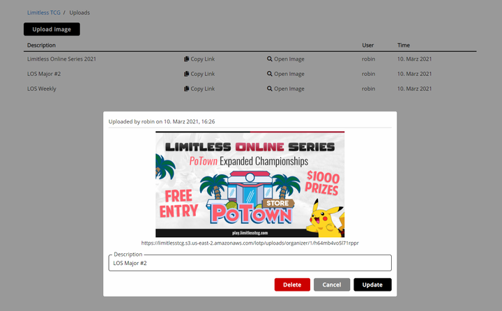
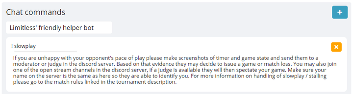
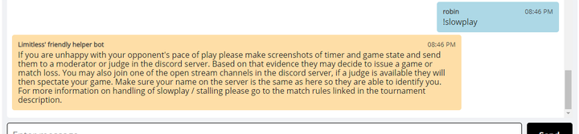

# More About Organizations

Here are some more topics about Organizations, that aren't essential for you to run a tournament, but very useful to know about.

## Uploads

Many places on the site like the tournament or organization description allow you to add images in addition to text. These images must hosted somewhere publicly available, one popular option being Discord. However, you can also upload them directly to the site, which is usually preferable over external services that could delete files at any point (especially free image hosting sites).

This is done on the organization's *Uploads* page, where you can upload and manage image files for further use throughout the site. 

To copy the image location to your clipboard, and then insert it into e.g. the tournament description through markdown, click *Copy Link*. The *Description* field does not affect the image in any way, and is only used on this page so you can quickly find the images you are looking for.

## Chat Commands

While judging tournaments, there are a lot of situations that come up over and over. To make dealing with judge requests faster, it can make sense to prepare answers for frequent questions and issues in advance. 

Chat commands are a feature that helps with that. You can set up a list of commands that every judge in one of your tournaments will have access to in match chats. To use them, the judge has to send a message that consists of the command name prefaced by an exclamation mark, and then the full message will automatically be posted after.

Enter a name for the bot and your commands:

The above command will look like this when used:

Some examples of situations that could warrant planning for and setting up commands:
* Slowplay claims
* Disconnects
* Setup / connection problems

## Banning Players

You might want to stop certain users from signing up for your tournaments. To do so, go to *Misc.* on the organization's admin page, and select *Banned Users*. On there, you can set a list of usernames that will be blocked from registering for any of the organization's tournaments. Input is one username per line.

Note that it needs to be the player's actual username (as used for login etc.), not a display name they use! To get the username of a player that participated in one of your tournaments, use the player list in the tournament's admin options (the value in the *User* column).

## Changing the Name

If you want your organization to be renamed, you can request so at the bottom of the *Profile* page. Once the new name has been confirmed, it will be used for any newly created tournaments. Already existing tournaments are unaffected by the change and will continue to display the name they were created with.