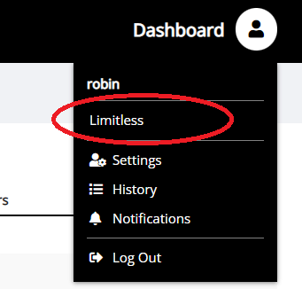
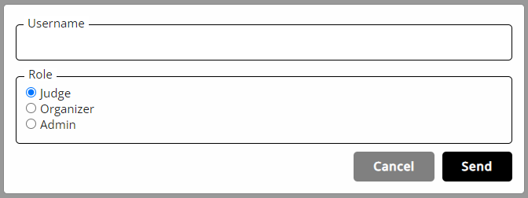
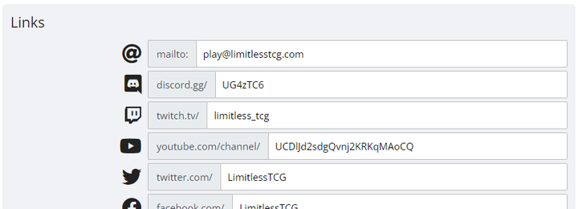

# Organizations

Tournaments aren't created as an individual user but as part of an organization. The organization can consist of any number of users, with different levels of permissions. When creating an organization, you will be its only member at the beginning, but can invite other users to join.

## Creating an Organization

To create an organization, fill out **[this form](https://play.limitlesstcg.com/user/apply)** and wait for it to be approved.

To check the status of your organizer application, either open the link you received after submitting the form, or check the [organizations page](https://play.limitlesstcg.com/account/settings/orgs) in your user settings. (*Please note that there are currently no email notifications upon approval, so you will have to check back manually.*)

Approval usually takes about a day or two. In case it takes longer than that, contact us in the discord server and update or re-submit your application.

Once approved, click the *Confirm* button to create the organization, which will add a link to its admin page to your user menu.

## Member Roles

There are three different member roles:
* **Admin**: Has full control over the organization - can create tournaments and series, invite other users, remove members, edit the organization profile and settings.
* **Organizer**: Can create tournaments and series, but cannot edit the organization staff or settings.
* **Judge**: Has no special permission within the organization itself, but can be added to existing tournaments and then have access to those.

## Inviting Other Users

To add other users to your organization, go to the *Staff* page and send them an invite with the appropriate role. Someone that got invited to the organization needs to confirm it in their [user settings](https://play.limitlesstcg.com/account/settings/orgs). Invites expire after 48 hours.

*Note: If you are logged in to the site on two different devices or browsers, and accept an admin invite on one of them, the user menu link is only added there. On any other device you will have to log out and log back in to see it.*

## Customizing the Profile

Every organization has a public profile on which players can find all of their public tournaments and tournament series ([Example](https://play.limitlesstcg.com/organizer/1)). To customize the logo, description and social / contact information on there, click *Profile* on your organization's admin page.

When editing the links, enter only the unique part of the destination page, not the full URL, e.g. entering `LimitlessTCG` in the twitter field will automatically link to `https://twitter.com/LimitlessTCG`. The youtube field uses the [ID-based URL](https://support.google.com/youtube/answer/6180214?hl=en) - if you usually use a custom URL, you can find your channel ID in the [youtube settings](https://support.google.com/youtube/answer/3250431?hl=en).

