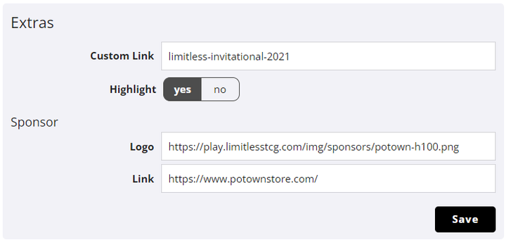
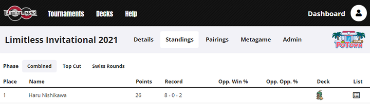
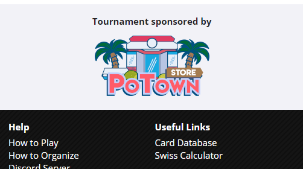

# Premium Features

Some organizers have access to a few additional features, most of which you can find in *Edit tournament > Extras*.

## Custom Link

A link to a tournament usually includes the tournament's unique ID, e.g. [`https://play.limitlesstcg.com/tournament/6092ad97817c757b68a82ce0`](https://play.limitlesstcg.com/tournament/6092ad97817c757b68a82ce0). 

If you set a custom link, the tournament will also be accessible by replacing the ID in the link with the selected identifier. E.g. with the setting above, the tournament is available at [`https://play.limitlesstcg.com/tournament/limitless-invitational-2021`](https://play.limitlesstcg.com/tournament/limitless-invitational-2021).

If you set a custom link, the ID version will still work, but internal links throughout the site will use the custom one instead.

**The custom link you choose must be unique among ALL tournaments on the site, not just your own ones!** For this reason, do not choose any generic names like "challenge-1" or similar, only ones that you are sure no one else would use! For example, you could prepend a generic expression with your organizer name, or the name of a tournament series.

You can also add a custom link for a tournament series in the same way. The option is found in *Edit series > General*.
E.g. [`https://play.limitlesstcg.com/series/limitless-online-2021`](https://play.limitlesstcg.com/series/limitless-online-2021).

## Featured Tournament

You might have already noticed that some entries in the list of upcoming and completed tournaments have a star in front of them, labeled *Featured Tournament*. This is supposed to signify to players that the tournament is run by a verified and trusted organizer, and is in many cases part of a popular tournament series.

To turn on the label for a tournament, set the *Highlight* setting to *yes*, as shown in the picture above.

## Sponsor Feature

If your tournament is sponsored by some external organization, you can add their logo to the public tournament page. Enter the location of the image file in the *Logo* field (either hosted through your *Uploads* page, or uploaded externally), and optionally a link that should be opened when the image is clicked.

The logo will then be added to every tournament page. On desktop, it is located in the top right, next to the navigation, while on mobile it is located at the bottom of the page.

## Homepage Feature

If you are running a regular tournament series and would like it to be featured on the front page of the site ([play.limitlesstcg.com](https://play.limitlesstcg.com/)), please contact us directly with the image you'd like included (should have about 16:9 aspect ratio).