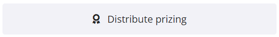
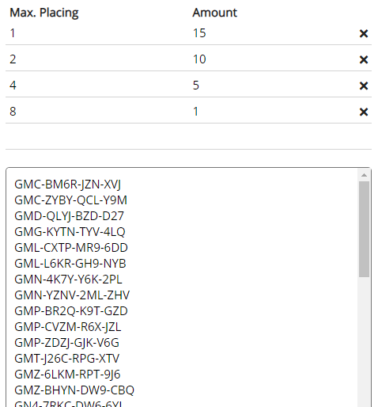
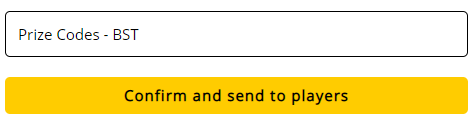
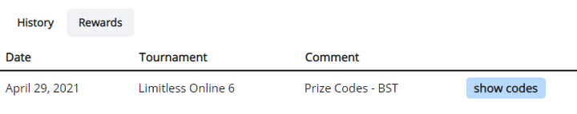
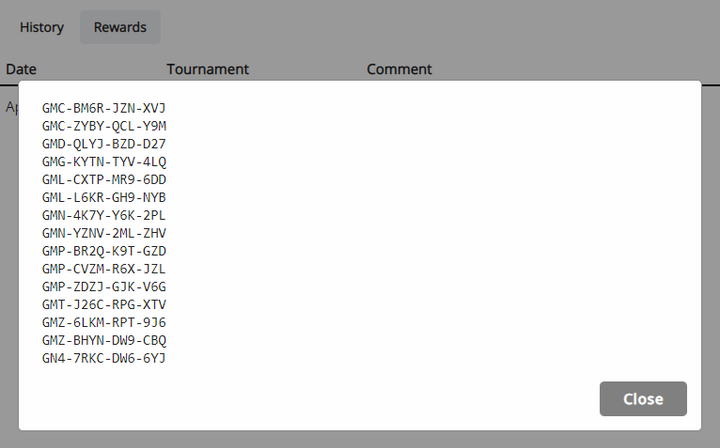
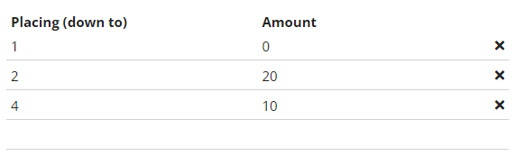
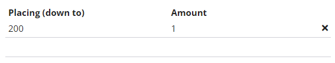

# Distributing Prizing

If your tournament uses PTCGO/PTCGL codes or similar text based codes as prizing, you can distribute them directly through the tournament platform, instead of having to contact players directly.

After a tournament has ended, a new option will appear on its admin page. You can not use this feature before the end of the tournament, since final placings are needed.

At the top of the page, enter the prize structure that should be used. In the left column, you enter the lowest placing that the right column should apply to. In the right column, you enter the number of codes that should be sent to each player in that placing range. The numbers do not accumulate, only the highest possible number is applied for every player.

For example, in the picture below, 1st place is sent 15 codes, 2nd place is sent 10 codes, 3rd and 4th place are sent 5 codes each, and the remaining top 8 players are sent 1 code each.

In the big text field, enter all the codes that should be distributed. Codes will be distributed from the top down, e.g. in this example 1st place receives the first 15, 2nd place the next 10, etc. If you did not enter enough codes to cover the selected distribution, you will receive an error message.

Once submitted, the page will display the calculated distribution below. You can use that to double check, or copy/save it for future reference.

You are also able to add an optional comment, like the type of codes, or reason for sending it. This comment will be displayed to players together with the name of the tournament.

It is possible to do multiple code distributions per tournament. If you do so, make sure to choose meaningful comments that make it clear to the players what kind of codes they got and for which reason.

To access the codes from the player side, there's a tab on the user's tournament history page. It displays all the code rewards they have been sent, together with the tournament they originated from and the admin's comment.

After clicking on *show codes*:

## Other Examples

If one placing range should be skipped for the code distribution (for example if they get other prizes instead) enter a 0 in the right column.

For example, the following distribution will send 20 codes to 2nd place, 10 codes each to 3rd and 4th place, and no codes to 1st place.

You can also use this feature for something like participation rewards. For example, for a tournament with 200 players, the distribution below will send 1 code to every player.

