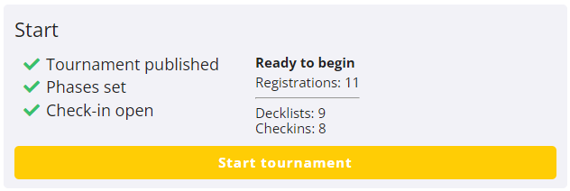
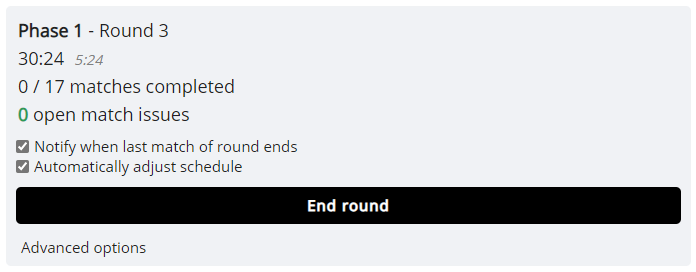
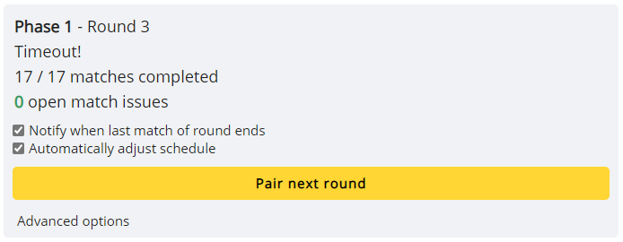
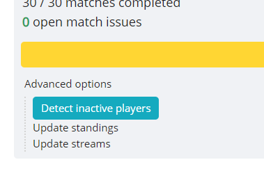
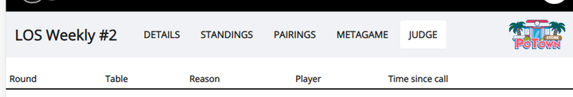
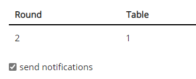

# Running the Tournament

Once it is time to start the tournament, the greyed out *Start tournament* button will become clickable.

During the tournament, the dashboard will show data about the current round and guide you through the actions you have to take. It will be updating automatically, so you don't need to manually refresh the page. You should usually have this page open at all times during the tournament.

Like on the player’s side, if the round timer is activated, it will count down on this page, and the check-in timer (if active) is shown next to it (the smaller grey time). You can click on the displayed match count to quickly open the public *Pairings* page.

Before you can start a new round, the current one needs to be ended. You can do this manually at any time, or it can happen automatically if the timer is configured to do so. If there are any active matches when the round is ended, they are automatically resolved with either a tie (if the game score is tied), or with a win for the player that is up in individual games.

If you pair a round while the *Automatically adjust schedule* option is active, the round start time in the tournament schedule and any associated timers will automatically be updated to the current time. See the [Tournament Schedule documentation](/organizer/schedule) for more information. Leave this option on unless you want to make manual adjustments as described on there.

The *Notify when last match of round ends* option will make it so you get a desktop notification once all matches in the round have finished.[^notif] This is useful if your tournament does not follow a strict schedule, and you want to pair rounds as soon as possible.

Once the final round of a phase is finished, the action button will give you the option to move players into the next one. Make sure standings are correct and there are no open match issues at that point, because while you can always edit all matches and re-calculate standings within the active phase, once you move on, all prior phases are final. Also, please pay attention to whether you have the chosen the correct pairing system for the phase you are about to start! It is not possible to re-pair or change the type of a phase once it has already started (you can still edit the round count or other type specific settings though).

**After the tournament, once all rounds are done and you verified all match results are correct, click *End Tournament* on the dashboard to archive the tournament and move it to the list of finished ones.** For public tournaments, this will also automatically send the tournament's data to [Trainer Hill](https://www.trainerhill.com/).

## Standings Updates

The tournament standings are automatically updated every time a round ends (manually or by timer). This makes it so by default, only complete rounds are reflected in standings and all players in there (unless dropped) have played the same amount of matches.

However, if you prefer to include partial round results in standings, you may choose to manually initiate an update at any time. To do so, click *Advanced Options* on the dashboard, and select *Update standings*. This will re-calculate standings will all finished matches from the active phase, including active rounds.

Note that updating standings takes into account all rounds of the active phase. This means you can reset and update matches from prior rounds, and then update the standings to correct them immediately, instead of waiting for the next round.

Another option you find there is *Update streams* (unless it's not a live tournament). Usually, active streams are updated at the start of every round, but with this you can initiate an immediate update. This can be useful for example if your own organizer stream went online after the start of the round and you want it to be included on the *Streams* page right away.

In live brackets (*Single/Double Elimination Bracket*, see [Phases documentation](/organizer/reference#phases)), standings are automatically updated once a match ends or is reset, so the *Update standings* button is not needed.

## Re-Pairings

If you for some reason need to re-pair a round, you can use the *Delete round* option under *Advanced Options*. This will reset the tournament to the end of the previous round. However, keep in mind that this will irrevocably delete all matches from the current round, so only use it when you have a very good reason. If players have already began their matches, it's usually better to not disrupt the tournament with a full re-pairing.

## Removing Inactive Players

In Swiss tournaments, players sometimes leave without dropping from the tournament. If the tournament uses match check-in, they will automatically be given losses for any rounds they don't show up to, but it still hurts the tournament experience for players that would rather have an opponent than get a free win.

During a Swiss phase with match check-in, you will see the following option in the tournament dashboard. It takes you to a page which shows you all players that missed rounds in the tournament and did not drop yet (+ which rounds they missed), and allows you to drop them directly from there.

One generally accepted guideline is to drop players that have missed two consecutive rounds in a row, but feel free to use this tool however you see fit.

## Resolving Match Issues

Everything that has been discussed up to this point has been admin only, but there's also the *Judge* role. All admins of a tournament are automatically judges as well.

A judge has access to all matches in a tournament (while players can only enter match pages they are a part of), can participate in the chat, reset a match, and report games.

Players can open a match issue in their match chat. This will automatically add the match to a special judge-only page, accessible through the tournament's main navigation, that displays all matches with active requests. The list is sorted by the time that has passed since the request happened, and takes you to the affected match when clicking on one.

Judges can receive desktop notifications about new requests by checking the box beneath the table of active requests.[^notif]

Once you have talked with the players and resolve the issue, click *Clear request* in the top right of the match chat to remove it from the list of active judge requests.

[^notif]: Note that to receive any notifications, you need to have turned on site-wide notification permissions with the *Notifications* option in the top-right user menu. The page sending the notification also needs to be open (although not necessarily focused), and you need to be using a desktop browser.