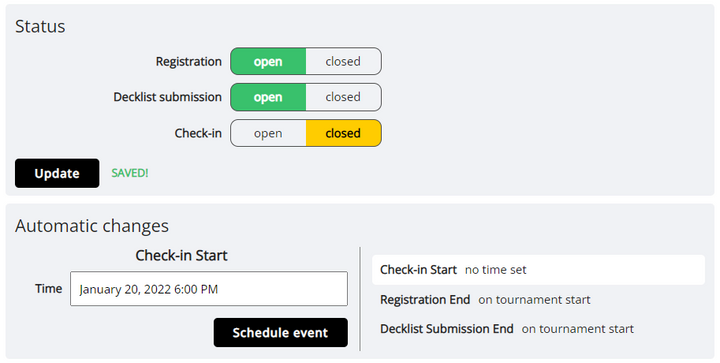

# Publishing the Tournament

Once you have set up the tournament to your liking, you are ready to publish the tournament. If it is set as a public tournament, it will now be listed as one of the [upcoming tournaments](https://play.limitlesstcg.com/tournaments/upcoming).

However, by default, registration is still closed, as well as possible other user actions.

To change this, it's time to move on to the next page, the *Dashboard*. This is where all tournament operations are controlled from.

Before the tournament, it shows you a countdown to the start of the tournament, any outstandings tasks, and some registration stats. And, more importantly, it lets you open or close registration, decklist submission (if applicable), and check-in (if applicable).

To open registration, set the option to *open* so that it turns green, and click the *Update* button. You can always manually open and close all of these options in this way.

However, in the case of the tournament check-in, it would be inconvenient having to open it manually, and it would be easy to forget. That's why, on the bottom of the page, you can set a time on which is should happen automatically. It is also possible to schedule registration closing, and decklist submission closing, if you don't want them to be open right up until the start of the tournament.

Note that even if you use this schedule feature, you can still override it at any time with a manual change. The option is simply the equivalent of you going onto the dashboard at the selected time and doing the change yourself.

If you schedule an action, the selected time will be displayed to players on the tournament's public *Schedule* page.