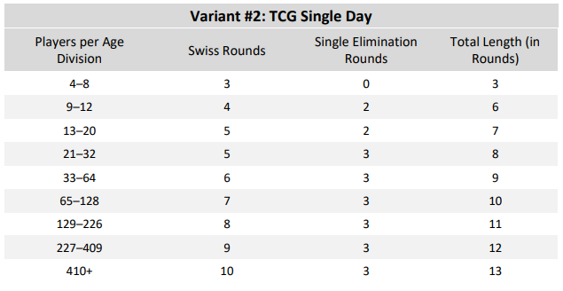

# Tournament Settings

## General
### Information
#### Date & Time
The time that is displayed to users as the start of the tournament. It is always displayed in the user's local time zone. The tournament can not be started before the selected point in time, but other than that this selection has no functional impact on tournament operations.

#### Type
The tournament platform is made and optimized for online events, but it's also possible to run in-person events on here. When settings this option to *Offline*, there will be a few small changes that make it better suited for the use case.
* The tournament gets a label on the list of tournaments that indicates it's an in-person event.
* There's no *Ingame name* field during registration.
* The match page displays the table number in the spot where you'd otherwise find the opponent's ingame name.

*Other optimizations might follow, if you are planning to run in-person events and have feedback, don't hesitate to contact us.*

#### Rounds
The default **Live** setting represents regular tournaments, where rounds are played right after each other. In the online environment, it's possible to run an alternative style of tournament, where players get a day or more per round to schedule a time with their opponent, and play on their own schedule. Set this option to **24h+** to add a label that indicates this kind of tournament. Tournaments with this settings are also grouped separately on a player's dashboard, and do not include the *Streams* page.

#### Public / Private
A public (and published) tournament is included on the [list of all tournaments](https://play.limitlesstcg.com/tournaments) and in the organization's profile. If it is not set as public, players will need the direct link to the tournament to find it, but everything else works as usual (unlike an "unpublished" tournament, which can not be interacted with at all as a regular user).

### Game Specific (Decklists)
This section slightly differs depending on the game the tournament is ran for. In every case, you will have the option whether the tournament uses decklist / teamlist submission.

With decklists on, players will have to submit the decklist they intend to use prior to the start the tournament. This makes it easy to run open decklist tournaments and enables metagame analysis features. Players that do not submit a decklist are automatically dropped from the tournament once it starts.

There are three different visibility settings for decklists:
* **Open**: All decklists and the metagame analysis are public and can be viewed by everyone.
* **Closed**: Only judges of the tournament can see decklists, no public information at all.
* **Open archetypes, closed decklists**: Decklists are only visible to judges, however everyone's deck archetype name is public (as well as icons, if available). Metagame analysis is available, but without the card usage page.

You can switch between these settings at any time. For example, if you want to have closed decklists during the Swiss rounds of a tournament, but open decklists during top cut, you would initially set this option to closed, and then update it before the start of top cut.

If you want decklists to be private during the tournament, but public after it has been completed, enable the *open after tournament* option. In that case, even if the above setting is set to private, decklists will be published as soon as the tournament has ended.

#### Pokémon TCG
Decklist submission is tied to the selected format of the tournament and will automatically check decklists for legality. There is a variety of current and historic formats available for you to choose from, both official and custom ones. If you want to run a tournament that is not covered by predefined options, select *Custom*. In a custom format tournament, decklist submission will only check for the existence of cards, as well as correct card counts.

For further customization of the decklist submission behavior, like adding custom bans and rules, check out the [Format](#format) section.

### Procedures
#### Point Structure
The scoring system to be used during the tournament. If you make ties worth zero points, they are functionally equal to losses.

Besides the regular match based scoring, you can select from options based on invidual games in a match. Those are mainly intended to be used in combination with the two-game format, but can also be used for regular bo3 matches. If the point structure includes the *bonus point*, a player who wins all games in a match receives an additional point for that match.

#### Tournament Check-in
If activated, players will need to confirm their attendance by clicking a check-in button before the start of the tournament. If they don't, they are automatically removed once the tournament is started. This will result in fewer no-shows during the first round. You can open check-in or schedule check-in in the tournament dashboard. It is recommended to open check-in about 30 minutes before the tournament.

Players that did not check in, but did everything else required to join the tournament (i.e. submitted a decklist), can still check in late during the first two rounds. In that case they are given a loss for every round that has already started ("missed round" on pairings and the player profile).

#### Standings
By default, players that drop during the Swiss rounds are still part of the standings and eligible for prizes and ranking points. If you activate the option to remove them from standings, they will instead be listed below everyone else, without a placing, no matter what their final score was.

### Links
You can add a discord and a twitch link that will be added to the info on the *Details* page.

If you add a twitch name, in a live tournament, the site will automatically check whether the channel is live at the start of every round, and add it to the tournament's *Streams* page if so.

## Registration
There are four different types of registration:
* **Open Registration**: Everyone can register, without any restrictions.
* **Entry Code**: You select a code that players need to enter during registration. The code is the same for everyone. Useful for e.g. community tournaments.
* **Single-Use Codes**: You generate a list of entry codes. Every code can only be used a single time and is then removed from the list. Useful for e.g. tournaments with entry cost.  
There is an [email tool](/organizer/code-emails) that can be used to make distributing these codes easier.
* **Invite only**: You enter a list of usernames that are able to register for the tournament. Useful for e.g. invitational tournaments.

*Notes about the Invite setting:* Enter the usernames of all the players that should be able to enter the tournament in the text input that will appear below. All other users will not be able to register for the tournament. Input must be one username per line. 
You need to enter the players' **usernames** for this option to work, not simply any display name they used! To get the username of a player in one of your tournaments, you can use the participants list in the admin options (first column). If the tournament is based on a series ranking, you can use the export functionality in the series options, open the file with any spreadsheet software, and copy-paste entries from the user column there. 

### Player Cap
You can set a maximum number of players that should be able to play in the tournament. If the cap is reached, players can still register, submit a decklist and check in, but will be placed onto a waiting list. When the tournament starts, after players that didn’t check in or submit a decklist are dropped, as many players as possible from the waiting list will be added into the tournament (in the order they signed up for it), until the cap is reached again. Note that someone one the waiting list needs to submit a decklist and / or check in just like everyone else to make it into the tournament!

### Other Options
By default, a player's display name in the tournament is their username, with full names being optional. If your tournament requires real names (e.g. important offline tournaments), you can enable the *require full names* option, which will force players to complete their profile and sign up with the name entered there.

### Custom Fields
If you need additional information from your players, you can add custom fields to the registration process. They can be either required or optional. You can access the entered information though the player list in the tournament's admin panel.
However, use this option with care and only ask for information that is necessary for you to run the tournament, in most cases the regular registration fields are enough.

### Late Players
Choose whether players should be able to join the tournament after it already started. Players who entered the tournament late receive a loss for every round they missed, and are then paired starting from the next round.

If late *Check-in* is activated, players who registered but missed checking in to the tournament can still join. If late *Decklist submission* is activated, players who registered but didn't submit a decklist can still do so. Note that this option does not affect the players already playing — they can not update their list under any circumstance. Late decklist submission is not recommended for tournaments with open decklists.

If late *Registration* is activated, even players who did not originally register can join late (and submit a decklist if necessary).

**All of these options apply for the first two Swiss rounds only!** After the start of round 3, no additional players are accepted. Elimination Brackets or Round Robin phases do not support late players at all.

See the [player documentation](/player/procedures#late-check-in) for additional details.

In the rare case that you want someone to join the tournament with a bye (free win) instead of a loss for the round they missed, first make them join the tournament through the regular late player procedures. Then, go to the bottom of the pairings page and open their *missed round* entry. From there, you can convert that loss into a bye for the round.

## Phases
### Settings
#### Name
The name of the phase is used for display purposes on many of the public tournament pages. If omitted, phases are named *Phase 1*, *Phase 2* and so on. Examples are names like *Swiss Rounds*, *Top Cut*, or *Preliminary Rounds*.

#### Pairing System
There are currently 5 different phase types, divided into two categories: Round based (Swiss, Single Elimination Rounds, Round Robin) and live bracket (Single Elimination Bracket, Double Elimination Bracket). In a live bracket, matches are automatically paired as soon as possible, e.g. a top 4 can start while a top 8 match in a different part of the bracket is still playing. In round based phases, all matches in a round start simultaneously once the round is started by the tournament admin.

Note: Both *Single Elimination Bracket* and *Single Elimination Rounds* follow a bracket structure and will generate the same matches! The only difference is the timing of matches. If you need them to start simultaneously or be timed, use "Rounds", otherwise the "Bracket" option is faster.

#### Rounds
For *Swiss Rounds* and *Single Elimination Rounds*, you manually define how many rounds are played. When in doubt about which number to choose, refer to the suggested round counts from the Play! Pokémon tournament handbook.

For a *Single Elimination Rounds* phase, you will usually set the amount of rounds to make it so only one player remains at the end. However, you can also select less, if for example you want finals to be played in bo5 instead of bo3. In that case, you would select one round less than usual, and make the top 2 players move into a separate phase, a 1-round bo5 Single Elimination phase.

**You can still adjust round counts during the tournament**, as long as it does not affect rounds that have already been paired.

In Brackets and Round-Robin, the round count or bracket structure is automatically determined by the amount of players in the phase. Brackets will always be set up so that they play out until the end. Unlike Single Elimination *Rounds*, you can not end a bracket before it reaches the finals. **For this reason *Single Elimination Bracket* and *Double Elimination Bracket* should only be used as the final phase of a tournament.** All other phases types can be chained at will.

Note that internally, a live bracket is equivalent to a single "round" of matches, which is why only the start of the bracket / phase is listed on the tournament's schedule page.

#### Match Mode
Defines how many games a player needs to win to be declared the winner of the match. In best-of-one, the match is a single game, in best-of-three / best-of-five a player needs two / three game wins.  
If you select the two-game format (only available for Swiss and Round-Robin), matches are exactly two games, even if the score is 1-1 (usually used in combination with game-based instead of match-based point structures).

#### First Table
Allows to change the starting point of table numbering for that phase (useful for e.g. side events at an in-person tournament).

### Setup
For all phases after the first one, you need to select how players get to advance to that phase. You can select between a fixed number of players from the top of the standings (*traditional cut*), or to move players that reached a certain amount of match points (*minimum point requirement*).

It is also possible to set both, in which case the fixed point requirement will always guarantee advancement, with the amount of players as a minimum amount of players to advance. E.g. with a setting of "19 points, 32 players" (equivalent to day 2 at official PTCG Regional Championships), all players with 19+ points advance, but if there is less than 32 such players, some with 18 or less might advance as well. 

### Timers
Round based phases can use timers. They are optional but can help make running tournaments easier. By default, timers will start the next full minute after a round is paired (see [Schedule](/organizer/schedule) for more details on exact timer behavior).  
**Note that both types of timers (round timer and check-in timer) are independent from each other and start at the same time.**

If you don't want the timers to start automatically, disable the *Automatically start timer when pairing a round* option. There will then be a button in your tournament dashboard that lets you manually start the timer.

#### Round Timer
If *Automatically resolve unfinished matches in timeout* is disabled, the round timer only has display purposes. If the option is enabled, matches are automatically ended once the timer hits zero. If the match score is tied at that point, the match will be a tie, if one player is up on individual games (in bo3/bo5), they are assigned the winner.

Automatic match resolution only works during Swiss or Round-Robin rounds, since there are no ties in Elimination brackets.

#### Check-in Timer
When enabled, players will need to click a visibly highlighted *Check In* button at the start of each match, which signals to their opponent that they are ready to play. If a player does not check in during the specified time frame after the start of the round, they are automatically given a loss. Players that received automatic losses due to inactivity in this way can be tracked and removed from the tournament on a special page of the tournament dashboard.

### Other Notes
#### Asymmetrical Top Cut
If a bracket (including *Single Elimination Rounds*) is started with a non-power of 2-number of players, the top X seeds will receive a bye in the first round (“asymmetrical top cut”). If it is the first phase of the tournament, the players that receive a bye will be selected randomly.

E.g. 10 players move into the Elimination phase of a tournament. #8 vs #9 and #7 vs #10 will be the "Top 16" pairings, #1-6 move directly into Top 8.

#### Tiebreakers
In Swiss rounds, the opponents’ win percentage is used as the tiebreaker if players are tied in match points. Their implementation for the most part follows the one used in official Pokémon TCG tournaments, as described in section 4 of the [tournaments rules handbook](https://www.pokemon.com/us/play-pokemon/about/tournaments-rules-and-resources/).

In Round Robin (all-play-all), the amount of individual game wins and losses are used as the tiebreaker (which is relevant if matches are played in bo3 or bo5).

If all tiebreakers are identical for two players, their final order will be random.

## Format
Depending on the selected game, this page gives you options to customize the deck check rules for decklist submission.

### Suspended Cards
Allows you to ban cards from being used in the tournament. Do not use this option for cards that are already officially banned in the format, as those are already included by default.  
If you want to ban all cards from a specific set, enter `*` in the *name* column.

#### Pokémon TCG
When adding a card to the list of suspended cards, note the following:
* The card's name needs to exactly (case-sensitive!) match the name as used in the Limitless Card Database / PTCGL. For example, GX Pokémon officially end with "-GX", while Vs do not include the hyphen. Search for the card in the database and copy-paste if you aren't sure how exactly it is named.
* If the card is a Trainer / Energy, or a Pokémon with only one version, you do not need to add the set and number. Any card with the entered name will not be accepted in decklist submission.
* If only a specific card with that name should be removed, enter the set and number. The set needs to be the set code as used on the website and in PTCGO, not the full name (e.g. "CEC", NOT "Cosmic Eclipse")! For a list of all codes go to the [sets list](https://limitlesstcg.com/cards) in the card database. The number also needs to exactly match the one used on the website.
* If a card has multiple prints, you just need to add its most recent regular print (so no Full Arts or Secret Rares), ignoring Promo prints.

#### Bandai Games
Split the card's id into *set* and *number* when adding it to the custom ban list. E.g. The input for "Agumon BT5-007" would be: Name - *Agumon*, Set - *BT5*, Number - *007*.

### Additional Rules
*Pokémon TCG only*

Selecting one or more of the custom rules will add these restrictions to decklists:

* **Singleton**: Decks can only contain one of each card, except Basic Energy. Cards with the same name can be included in the deck if they have different effects, identical reprints however count as the same card.
* **Monotype**: Decks can only contain one type of Pokémon. Colorless Pokémon do count as their own type. Multitype Pokémon are not allowed.
* **Single Prize only**: All EX, GX and V Pokémon are banned.
* **No Rule Box cards**: All cards with a Rule Box are banned: EX, GX, V, Prism Star, BREAK
* **No VMAX**: All Pokemon VMAX are banned.
* **No Tag Team Pokémon**: All Tag Team Pokémon are banned (Tag Team Supporters are still allowed).

Tournaments that use custom rules will not appear in the format statistics on the website's *Decks* page.

Pre-configured custom formats like *Gym Leader Challenge*, that can be selected in the format setting, already include their special rules! Don’t use the settings here when creating a tournament in that format (you can still use the ban list though!), as it will cause them to be excluded from statistics. (Unless of course you want to add rules that are not already part of the custom format.)