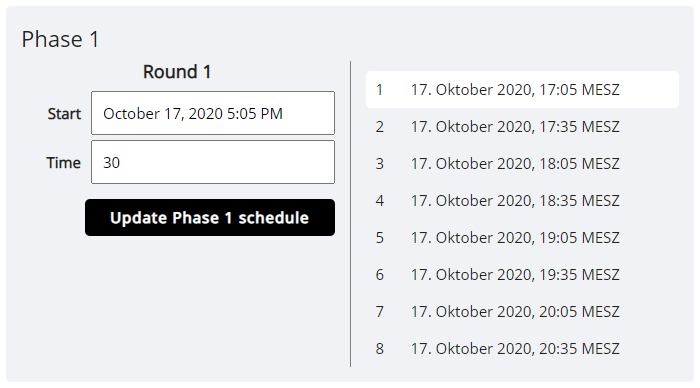

# Tournament Schedule

Every tournament always comes with a schedule that defines the start of individual rounds. It is automatically generated when you start a tournament, and (by default) updated whenever you pair a new round, so you do not necessarily need to directly interact with it.

However, if you run tournaments with either round or check-in timers, it can be beneficial to understand its exact functionality.

Timers do not directly care about when a round is paired. Instead, they start exactly at the time that is defined as the start of the round in the tournament's schedule. By default, an option called *automatically adjust schedule* is selected in the tournament's admin dashboard, which makes it so the schedule will match the time a round is paired (the round start in the schedule will be set to the next full minute after pairings went up).

In some cases, you might want to change this behavior, which you can do with the *Edit schedule* page in the tournament's admin options.

To edit the schedule, select a round on the right (or bottom, on mobile), and then select a starting time. All subsequent rounds in the same phase will automatically be adjusted, for which you need to also enter the time between two rounds.

Now, if you start one of these rounds with the *automatically adjust schedule* option disabled (in the dashboard), timers will respect the chosen time. 

E.g. a round in your tournament finished early and you want to get the next one started immediately. However, your rounds do have a 5 minute check-in timer, and you are afraid some players might miss the round if you start it 5 minutes earlier than originally planned. It is currently X:30. To compromise, you schedule the round start to X:35, but pair the matches immediately. Players that are present can already start playing, but timers won't start until exactly X:35, which means players that left for a bit will be back in time.

If you make changes to the schedule that affect a round that is in progress, the active timers will be automatically adjusted accordingly to the new starting time.

**The tournament's schedule is always publicly available through the *Schedule* page.** It is usually a good idea to set up a tentative schedule in advance, so players know what to expect when registering for the tournament. Any changes made to the schedule, automatic and manual, will always be immediately updated on this public page.