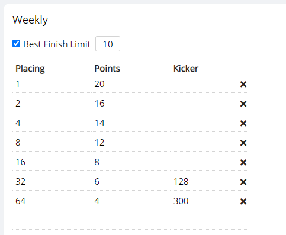

# Tournament Series

You can use the site to create automated rankings and a landing page for a series of tournaments ([Example](https://play.limitlesstcg.com/series/limitless-online-2021/details)). To start, go to *Series* on your organization's admin page and create one.

## Setup

The *Edit series* page is similar to the equivalent page for tournaments that you already know. In the *General* tab you can set a name for the series as well as a description. Styling text and inserting images works exactly the same as for the [tournament description](/organizer/basics.html#adding-a-tournament-description).

If you set the *visibility* to *public*, a link to the series page will be displayed in your organizer profile. If it is set to public, users will need the direct link to find it. The *Status* option is mainly for display purposes. Once all the tournaments in the series have finished and you do not plan to add any further ones, set it to *Completed*.

### Point Structure

The *Point Structure* tab is where you define the different types of tournaments in the series and their point payouts for the ranking. You need to add at least one tournament type before you can assign tournaments and create rankings. It is possible to add a *Best Finish Limit* to a tournament type, or *Kickers* to certain tournament placement ranges. Both work the exact same as in official Play! Pokémon tournaments ([Reference](https://www.pokemon.com/us/play-pokemon/about/tournaments-glossary/)).

In the *Placing* column, enter the lowest placing for which the point payout in the right column should apply to (e.g. “32” for Top 32, not “17-32”). The site automatically sorts all placings and gives out the correct maximum possible points for a finish.

In the example above, 1st place in a tournament that has been put into the "Weekly" category receives 20 ranking points. 2nd place receives 16 points, 3rd and 4th place receive 14 points, the remaining top 8 players receive 12 points, etc. If the tournament has over 128 players, top 32 players receive 6 points (if it has less, they get 0), and if it has over 300 players, top 64 players receive 4 points. There is a best finish limit of 10, so only each player's 10 best "Weekly" finishes are counted for the ranking.

You can set up different types of tournaments with different point payouts. Your tournament series' structure is available for players to look at below the series description on its public *Details* page.

## Adding Tournaments

Once you have created at least one type of tournament as described above, you can go to the *Select tournaments* page to assign tournaments as part of the series. You can add any of the organizations's tournaments, even if they are already part of a different series.

Use the *Load tournaments* button to list all of the available tournament, optionally restricted to ones after a certain date (useful if you have a lot of different tournaments). Then, use the drag and drop interface to put the tournaments into the appropriate category, and hit *Save*. You can add and remove tournaments in this way at any point.

To create or update the ranking, use the *Update Ranking* button. **Rankings are *not* automatically updated whenever a tournament finishes, you change the point structure, or add/remove tournaments.** Whenever the ranking should be updated, go to this page and click the Update button.

You can download a csv file of the current ranking with the *Download* button.