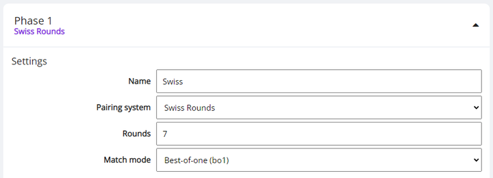

# Tournament Structure

The most important setting of your tournament is the round structure, which you need to define in *Edit tournament > Phases*. The tournament can consist of any amount of phases, which each represent a set of rounds. Every phase can use different settings, for example, it's very common to run the first phase as Swiss rounds, followed by a Single Elimination Bracket as the second phase.

Player scores carry over between phases and players are automatically seeded according to their current placing when moving into a new phase. The different pairing systems (Swiss, Single Elimination, Double Elimination, Round-Robin) can mostly be combined in any way, with a few constrains. See the complete [phase settings reference](/organizer/reference#phases) for all details.

## Timers

Round based pairing systems can use a round timer, which can either be used for display purposes only, or to automatically resolve unfinished matches when time runs out. You also have the option to set a check-in timer, which will make it so players will need to join their matches within that timeframe, or be given an automatic loss if they don't. See the [timer reference](/organizer/reference#timers) for details.

By default, the timers will start on the next full minute after pairings are generated. If you need a different behavior, you can gain full control over it by making manual changes to the [tournament schedule](/organizer/schedule).

## Making Changes

If you are not sure about the exact structure of your tournament yet, you can come back to it closer to the start of the tournament. Make sure to include your plans for it in the tournament description, so players know what to expect.

After having started the tournament with a certain phase structure, you can still make adjustments during the tournament.
**The round count and most other settings of active or upcoming phases can be edited at any time.** If for any reason you want to play a different number of rounds than originally planed, just edit the appropriate phase. However, you cannot change the pairing system (e.g. Swiss to Single Elimination) of a phase that has already started.