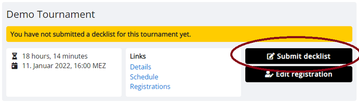
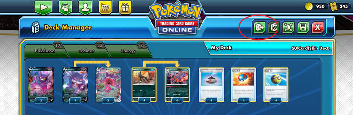
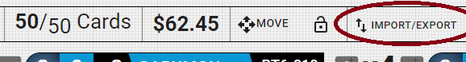
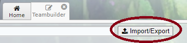

# Decklist Submission

Most tournaments will require you to submit a decklist before the start of the tournament (or, in the case of VGC tournaments, a teamlist, but for simplicity we'll refer to it as decklist for the rest of this guide). If you do not submit a decklist in time, you will be removed from the tournament and not be able to play!

To submit your decklist, find the tournament in your dashboard and click the *Submit decklist* button. Alternatively, if you haven't submitted a decklist yet, you will see a reminder on the public tournament page that will take you to the submission form.

On there, paste your decklist into the text field and click the *Submit* button. If there are any problems with the decklist, you will be alerted, otherwise you'll see a confirmation. For tips on how to easily get a compatible text version of your decklist see the sections below.

**You can re-submit your decklist as many times as you want as long as decklist submission is open.** Your most recently submitted decklist is the one that will be used in the tournament, prior submissions are immediately discarded. To submit a new decklist, find the tournament in your dashboard and open the form with the *Edit decklist* button.

## Pokémon TCG

It is recommended to export your decklist directly from PTCGO. Simply click the **Export Deck** button in the deck manager and the list will be automatically copied to your computer's clipboard.

::: info
If you are using PTCGO in a different language than English, this method still works, however a few cards might not be recognized at first. In particular, the default Basic Energies with no set identifier are known to cause issues. In that case, either manually change their name to the English equivalent, or replace them with ones that are recognized by the website.
:::

Alternatively, you can use a web based deck builder like [pokegear.app](https://pokegear.app/), which also provides export functionality.

## Digimon Card Game

It is recommended to create your deck in an online deck builder like [digimoncard.dev](https://digimoncard.dev/) or [digimoncard.io](https://digimoncard.io/) and use the export functionality provided by those sites.

## Pokémon VGC

Team exports need to follow the [pokepaste](https://pokepast.es/syntax.html) format as known from popular teambuilder apps like Showdown. Build your team there and use the provided export functionality.

