# Decklist Submission

Most tournaments will require you to submit a decklist before the start of the tournament (or, in the case of VGC tournaments, a teamlist, but for simplicity we'll refer to it as decklist for the rest of this guide). If you do not submit a decklist in time, you will be removed from the tournament and not be able to play!

To submit your decklist, find the tournament in your dashboard and click the *Submit decklist* button. Alternatively, if you haven't submitted a decklist yet, you will see a reminder on the public tournament page that will take you to the submission form.


On there, paste your decklist into the text field and click the *Submit* button. If there are any problems with the decklist, you will be alerted, otherwise you'll see a confirmation. For tips on how to easily get a compatible text version of your decklist see the sections below.

**You can re-submit your decklist as many times as you want as long as decklist submission is open.** Your most recently submitted decklist is the one that will be used in the tournament, prior submissions are immediately discarded. To submit a new decklist, find the tournament in your dashboard and open the form with the *Edit decklist* button.

## Pokémon TCG

You can export your decklist directly from PTCGL. Simply click the **Export** button in the deck manager and the list will be automatically copied to your clipboard.

Alternatively, create your deck in the [Limitless Deck Builder](https://my.limitlesstcg.com/builder?game=PTCG) and export it with *Share > Copy as Text*.

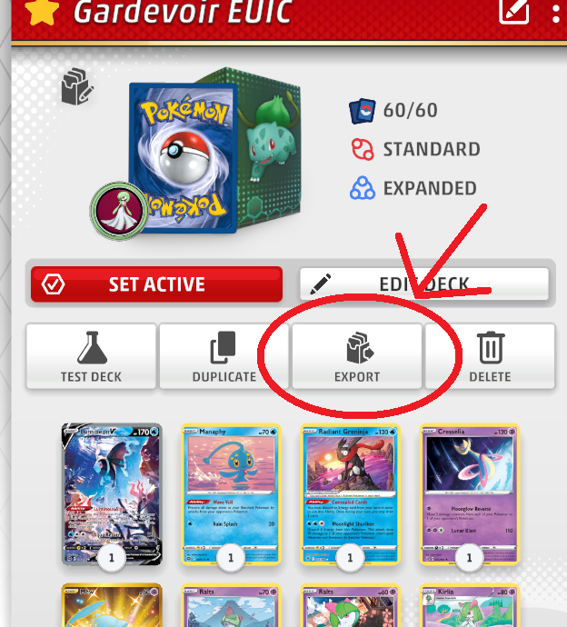
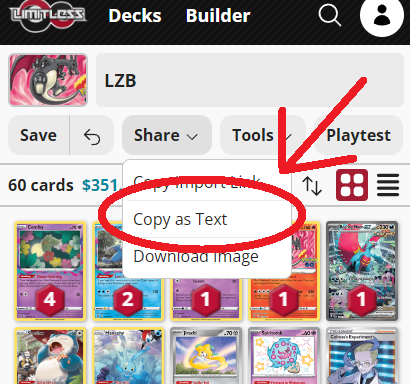

### PTCGL ALT Cards
When exporting from PTCGL, certain Promo variants use a in-game exclusive numbering system instead of their proper set code and number. E.g. Cosmo foil Boss's Orders from the Premium Tournament Collection is listed as *SWSHALT 127* instead of *BRS 132* (as printed on the card). If you try to submit a decklist containing such cards, the site will not be able to find them and give you an error. **Don't try to edit the set code manually**, as that could cause the card to be interpreted incorrectly!

If you are trying to submit a Trainer or Energy card and your game is set to English, it's enough to remove the ALT code and number altogether, as the card can then be found by only its name. However, if it is a Pokémon, or card in a different language, the proper set code and number are necessary! Replace the ALT card in your PTCGL deck with a regular version, or import your deck into the Limitless Deck Builder, add the missing card, and export it from there.

## Pokémon VGC

Team exports need to follow the [pokepaste](https://pokepast.es/syntax.html) format as known from popular teambuilder apps like Showdown. Build your team there and use the provided export functionality.


## One Piece Card Game

You can export your deck directly from OPTCGSim, or create your deck in the [Limitless Deck Builder](https://my.limitlesstcg.com/builder?game=OP) and export it with *Share > Copy as Text*.

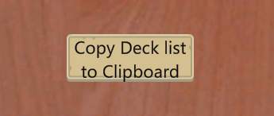
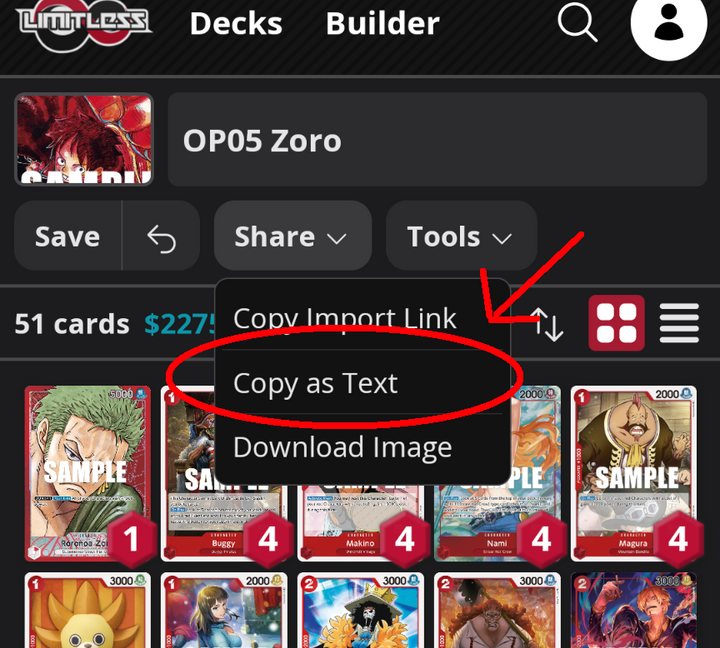

Example input:
```
1 OP01-001
2 OP01-005
4 OP01-006
4 OP01-011
4 OP01-016
4 OP01-017
...
```

## Digimon Card Game

It is recommended to create your deck in an online deck builder like [digimoncard.dev](https://digimoncard.dev/) or [digimoncard.app](https://digimoncard.app/) and use the export functionality provided by those sites.


If the tournament uses side decks, either use the dedicated side deck field, or add a new line with the words "Side Deck" below your Main/Egg deck cards, and list all the additional cards below that.

Example input:
```
4 Bokomon BT7-081
3 Salamon BT2-034
3 BushiAgumon BT4-038
...

Side Deck
1 Koichi Kimura BT7-091
1 Matt Ishida BT2-090
...
```

## Dragon Ball Super Fusion World

You can export your deck directly from Fusion World Digital. Simply click the *Deck Code* button on the *Check Deck* screen to copy the text version to your clipboard.

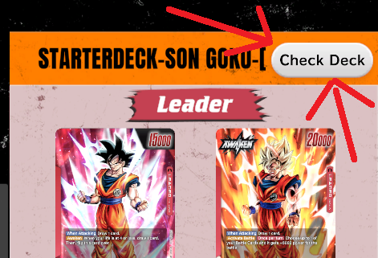
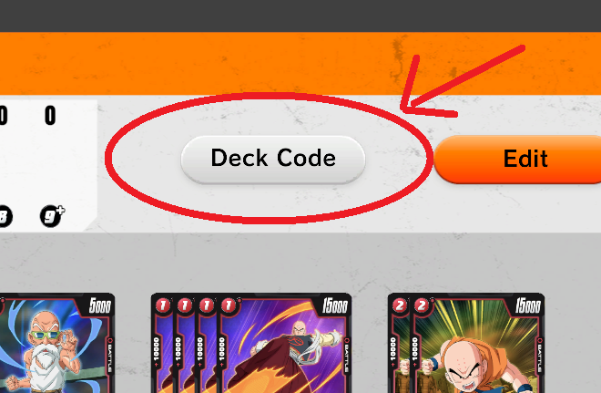

Alternatively, create your deck in an online deck builder like [deckbuilder.egmanevents.com](https://deckbuilder.egmanevents.com/) and use its export functionality.

Example input:
```
1 FB01-001
4 FS01-03
4 FB01-005
3 FS01-04
4 FB01-014
...
```

## Dragon Ball Super Masters

You can use card numbers, card names, or both. Leader and Z-Deck cards are automatically detected and do not need to be listed separately.

If the tournament uses side decks, either use the dedicated side deck field, or add a new line with the words "Side Deck" below your Main/Z-deck cards, and list all the additional cards below that.

We recommend building your deck on [dbs-deckplanet.com](https://www.dbs-deckplanet.com/) and using their text export functionality.


Example input:
```
1 BT18-001
3 BT17-008
3 P-177
2 DB2-143
3 BT18-005
...
```

```
1 Son Goku & Vegeta // SS4 Son Goku & SS4 Vegeta, In It Together
3 Son Goku, Adventure's Advent
3 Broly, Crown of Retribution
2 Koitsukai, Mechanical Courage
3 Rush Attack SSB Vegeta
...
```

## Battle Spirits Saga

You can use card names, card numbers (in which case names are automatically added), or both. We recommend building your deck on [bssdb.dev](https://www.bssdb.dev/) and using their text export functionality.

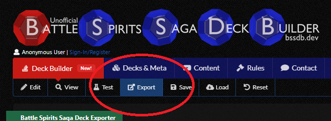
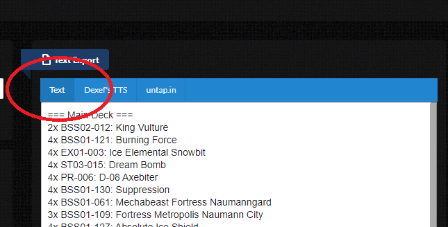

If the tournament uses side decks, either use the dedicated side deck field, or add a new line with the words "Side Deck" below your Main deck cards, and list all the additional cards below that.

Example input:
```
4 Pegacyone
4 Head Icemaid Fulla
3 Fortress God Knight Odin Type-X
4 Divine Moonsky Beast Fanatech Elk
...

Side Deck
4 Cannon Beastmech Liomail
...
```

## Disney Lorcana

Cards are added exclusively by their name. We recommend building your deck on [dreamborn.ink](https://dreamborn.ink/) and using their text export functionality.

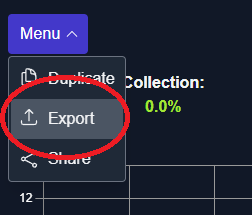
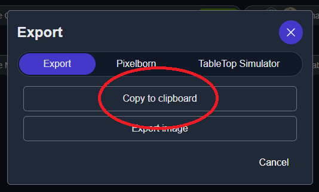

Example input:
```
4 Aladdin - Street Rat
4 Aladdin - Heroic Outlaw
4 Mickey Mouse - Brave Little Tailor
4 Maleficent - Monstrous Dragon
4 Maui - Hero to All
4 Aurora - Regal Princess
...
```

## Star Wars: Unlimited

Cards can be found either by their name (e.g. "Luke Skywalker, Faithful Friend"), or their set code and number combination (e.g. "SOR-005").

Example input:
```
1 Luke Skywalker, Faithful Friend
1 Administrator's Tower
1 Rebel Pathfinder
2 Yoda, Old Master
2 SOR-049
3 SOR-236
...
```

Alternatively, instead of typing out all the names or numbers, build your deck on [swudb.com](https://swudb.com) and use their *.json* export feature. You can paste the json output into our decklist submission form and it will be converted into a plain text version of your list after you submit it. Do not split the json data into main and side deck when using this method — this will be done automatically.

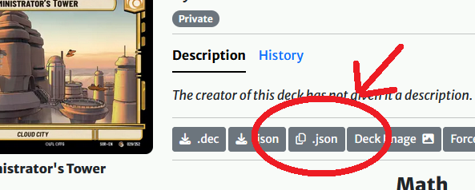

Example input:
```
{
  "leader": {
    "id": "SOR_005",
    "count": 1
  },
  "base": {
    "id": "SOR_029",
    "count": 1
  },
  "deck": [
    {
      "id": "SOR_195",
      "count": 1
    },
    {
      "id": "SOR_044",
      "count": 2
    },
    ...
  ],
  "sideboard": [
    ...
  ]
}
```

## Pokémon TCG Pocket

You can create your deck in the [Limitless Deck Builder](https://my.limitlesstcg.com/builder?game=pocket) and export it with *Share > Copy as Text*.

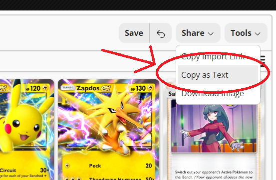

Example input:
```
2 Pikachu A1 94
2 Raichu A1 95
2 Pikachu ex A1 96
2 Zapdos ex A1 104
2 Sabrina A1 225
2 Lt. Surge A1 226
2 Poké Ball P-A 5
2 Professor's Research P-A 7
2 Potion P-A 1
2 X Speed P-A 2
...
```