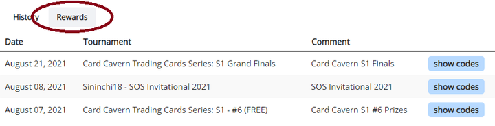

# Tournament History

You can track all the tournaments you participated in on your personal tournament history page. Click on *History* in the user menu and you'll have access to all your past placements, decklists and more!

Additionally, depending on the kinds of tournaments you play in, you might find yourself needing the *Rewards* page. Tournaments oftentimes give out PTCGL codes or similar text based prizes, which can be distributed directly through the platform and claimed on that page. Refer to the tournament description and possible announcements by the organizer for more information.

