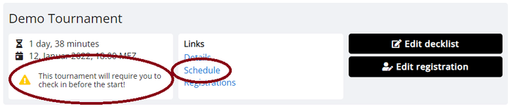
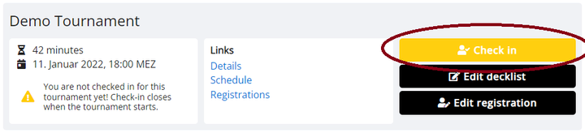
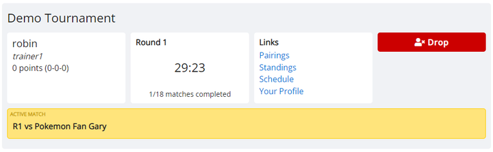
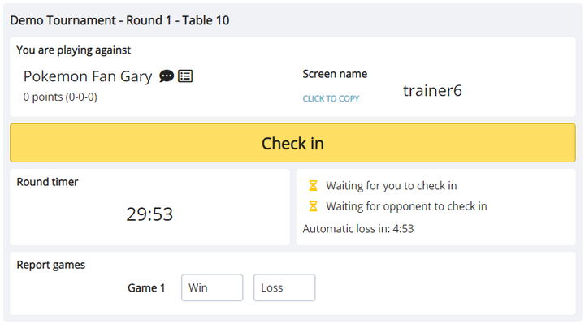
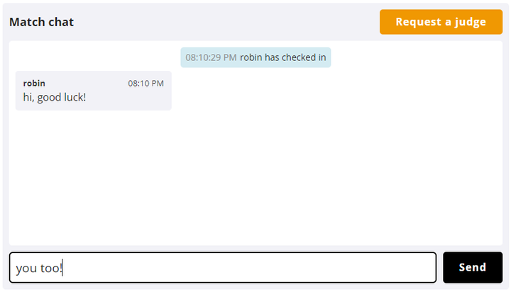
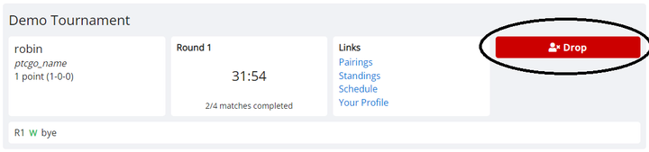

# During the Tournament

As a general rule, you should refer to your [dashboard](https://play.limitlesstcg.com/dashboard) for all tasks relating to your tournament participation.

## Tournament Check-in

Tournaments may require you to check in to the tournament before it starts. This is done to remove any players that registered, but didn't show up the day of the tournament. You can find out whether a tournament requires a check-in by going to its entry in your dashboard, or by checking the tournaments *Schedule* page.

Once the tournament check-in opens, usually about 30 minutes before the first round, you will find a button for it on your dashboard. There will also be a check-in button on the public tournament pages.

## Finding Your Pairings

Your dashboard will automatically update you about your opponents throughout the tournament, and a currently active match will be visibly highlighted. 

Click on the match entry to be taken to the match page, where you will find information about your opponent, be able to chat with them, and report your games (see section below).

If the tournament is using timed rounds, both the dashboard and the match page include a timer which lets you know how much time is left in the round. If the rounds are untimed, there will instead be a stopwatch that shows the amount of time that passed since the start of the round.

## The Match Page

On the match page, you will find your opponent's screen name that you need for adding them in the game. If you are playing in a webcam tournament, instead pay attention to the table number that is listed at the top of the page, next to the tournament and round name. Your tournament organizer most likely has set up numbered channels for you to join in their discord server (as always, refer back to the tournament description for details).

If the current phase of the tournament is using match check-in, you will need to click the highlighted check-in button within the specified time frame after the beginning of the round. Players that do not show up to the match in time (i.e. that do not check in), will automatically be given a loss for the round. This makes it easier for the tournament staff team to deal with inactive players.

To report a game, click the *Win* or *Loss* buttons. If the match is played as a best-of-three (or bo5), each game is reported individually. If you clicked the wrong button, you can click on it again to remove the report. Once both players reported the same outcome, or 15 seconds pass, the game report is automatically verified. You can call a judge to reset the match in case there were any mistakes.

Below the main panel there is a match chat that you can use to communicate with your opponent. In case there are any issues with the match, you can call a judge into the chat with the button in the top right.

If the tournament is using open decklists, the match page will display your opponent's decklist below the match chat for your convenience. 

## Dropping

If you do not wish to continue in the tournament, you can choose to drop. You will then not be paired in any of the remaining Swiss rounds.
To drop, go to the tournament's entry in your dashboard, click the red *Drop* button, and confirm twice.

You will still appear in the standings of the tournament with the amount of points you earned in the rounds you played.

## Notifications

If you have given the site notification permissions, your dashboard will automatically send you a desktop notification every time a new round in the tournament is starting. However, please keep in mind that these are desktop notifications only, and won't work when using the site on a mobile device. Your dashboard does not need to be focused to send you a notification, but it needs to be open in the background at least.

To enable notifications, go to *Notifications* in the user menu (below *History*, above the *Dark Theme* toggle) and click the *Enable Notifications* button. This should prompt the browser to ask you for notification permissions.

If you want to disable notifications, follow your browser's documentation, as they all have their individual ways to handle notification settings.

## Late Check-in

In tournaments that require decklist submission and/or check-in, players that didn't do so in time are removed once the tournament starts. However, the tournament organizer may allow players to join late during the first two rounds.

If you are in this situation, go to your dashboard, where you'll see the *Late Check-in* button. If you still need to submit your decklist, first do so, and then return to the dashboard. On there, you'll need to confirm that you want to be added back to the tournament. If you choose so, you will receive a loss for every round you missed, and appear in pairings starting from the next round.

If you joined a tournament through late registration, you need to follow the same steps as above. Notably, you need to confirm the "late check-in" in your dashboard, even if the tournament did not originally use a check-in!