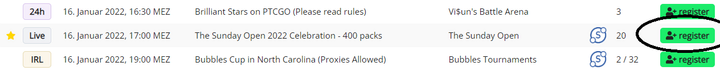
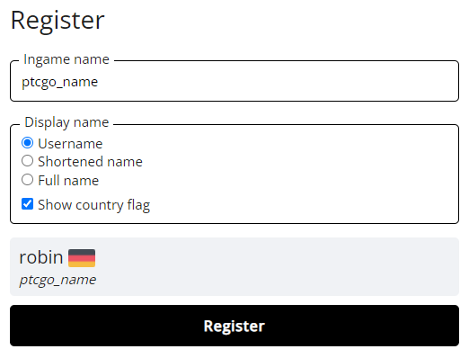
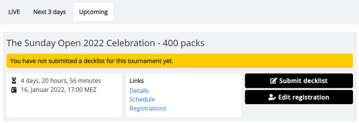
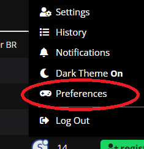

# Tournament Registration

To find a tournament you want to play in, browse the list of [upcoming tournaments](https://play.limitlesstcg.com/tournaments/upcoming). You can filter the list by game or format, and sort it by clicking on one of the table headings.

Most tournaments are free to enter, but some may have different entry requirements. Make sure to always read the tournament details of a tournament you are interested in!

In addition to regular tournaments that are played in real-time, there are occasional ones that use asynchronous rounds. In these tournaments, players get a day or more every round to coordinate a time with their opponent and play on their own schedule. They can be identified by the *24h* tag in the leftmost column.

To get to a tournament's registration page, either click the green *register* button in the tournament list, or use the link at the top of the tournament specific pages.

The date and time displayed everywhere on the site is automatically converted to your device's time zone.

## The Registration Form

On the registration page, enter the ingame name of the account you will be playing with during the tournament. If the tournament you are signing up for is played over webcam instead of a simulator, enter something like your discord name instead (refer to the organizer's instructions).

You may also customize the way you will be displayed in the tournament standings and pairings. By default, only your username is shown, but you may choose to add the name and country info from your account settings.

## Your Dashboard

Once you registered for a tournament, an entry for it will be added to your [dashboard](https://play.limitlesstcg.com/dashboard). It shows you the most important information about the tournament and guides you through all procedures before and during the tournament.

If you want to edit any of the information entered in the previous step, or unregister from the tournament before it starts, use the *Edit registration* option here.

## Customizing the Tournaments List

Most of you will not be interested in all the games that organizers can run tournaments for on the platform. To customize which ones are displayed on the [tournaments page](https://play.limitlesstcg.com/tournaments), open the user menu in the top-right, and click on *Preferences*. This will show you a list of games, with which you can select the one(s) you want to see. The *Most Relevant* tab on the tournaments page will now only show tournaments of those games, and the tournament filter in *Upcoming* and *Completed* will have the game(s) pre-selected when opening the page.

Note that this selection is per browser, and not linked to the account system. It can also be used when visiting the site without being a logged-in user.

