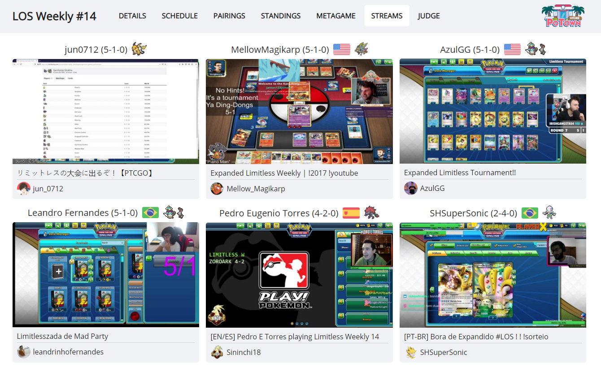
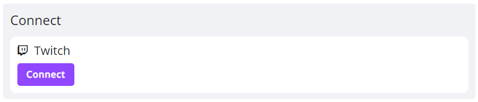

# Twitch integration

If you are streaming tournament matches on twitch, you can connect your twitch account to the site. Then, while you are playing in a tournament, it will check whether your channel is live and, if yes, link it on the tournament's *Streams* page. Active streams are updated once per round.

To connect your twitch account, go to your [account settings](https://play.limitlesstcg.com/account/settings/profile), click the *Connect* button at the bottom of the page and follow the steps there.

Note that the account name and icon are only pulled once, when connecting the account. If you change either of them and want that reflected on the site, click the *Update* button and re-authenticate your channel. Alternatively, remove the connection and re-add it.

## YouTube streams
YouTube streams are not supported since their platform does not provide an equivalent [API](https://dev.twitch.tv/docs/api) for channel activity. However, we will be checking back periodically and might implement the feature at some point in the future if possible.